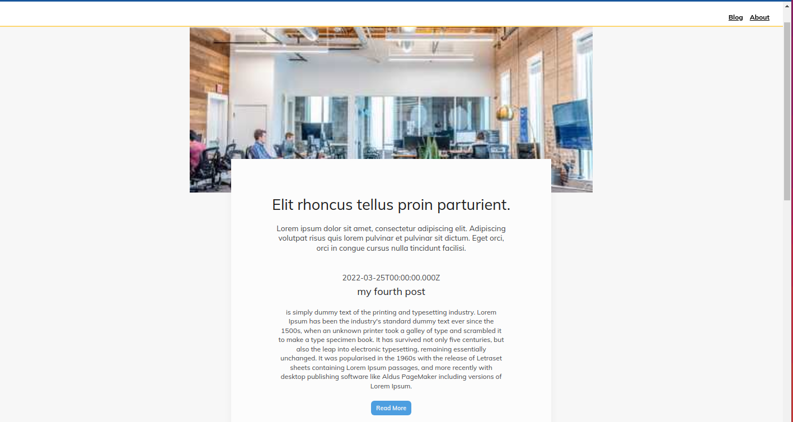
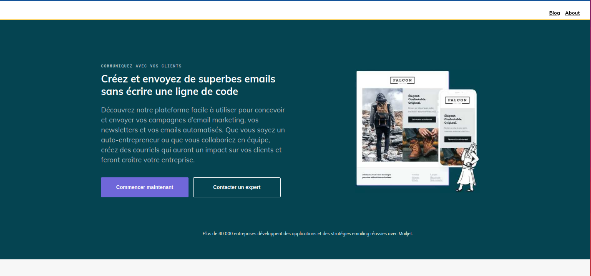
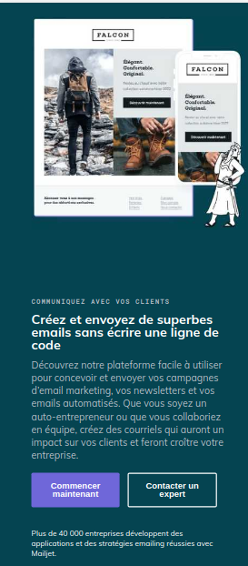

<!-- AUTO-GENERATED-CONTENT:START (STARTER) -->

  

<h1 align="center">
  Alexander's First blog in Gatsby.js
</h1>

This a full blog in gatsby.js react and MDX
I am using styled components css Grid and flex for the styling.

I created blog post in MDX format 
and than display them  with help of the inbuild graphQl Api to fetch each blog form gatsby-source-filesystem.

For image optermisation on diffrent screen sizes I use  gatsby-plugin-image, gatsby-plugin-sharp, gatsby-transformer-sharp.

I created blogPost template pages and use the gatsby-node.js to auto gernerate pages for each blog post.

## Available Scripts

In the project directory, you can run:

### `gatsby develop`

Runs the app in the development mode.\
Open [http://localhost:8000](http://localhost:8000) to view it in your browser.

----------------------------------------------------------------------------------
I as well create with styledComponents and css Grid a Mailgun about page Clone. 
I am use a 12 column grid and I than change the grid area of the components depending on the screen-size

----------------------------------------------------------------------------------

